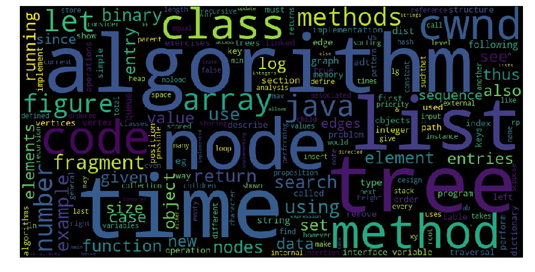

# ingles_instrumental_ti
Análise que busca estrair através de livros texto de cursos de TI um dícionário de palavras-chave

## Livros utilizados
- AI : Artificial Intelligence-A Modern Approach (3rd Edition).pdf
- computer networks : An Introduction to Computer Networks
- computer organization (architeture) : Structured Computer Organization (5th edition)
- data structures : Data Structures and Algorithms in Java (4th Edition)
- analysis of algorithms: An Introduction to the Analysis of Algorithms (2nd_Edition)
- formal languages and automata: An introduction to Formal languages and Automata (5th)
- theory of computation: Introduction to Theory of Computation (Anil Maheshwari)
- algorithms: Algorithms (Jeff Erickson)

## dependências
- PyPDF2
- nltk
- wordcloud

## Código
[Jupyter Notebook](Analysis.ipnb)

## TagCloud

## Cotribuidores
@judsonmb
@armandobs14